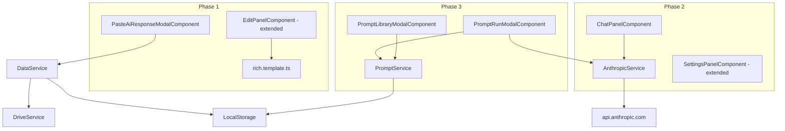

# AI-Powered Lore — Design Document

## Overview

This document describes the technical design for adding AI-powered features to Lore, an Angular 17 standalone notes app. The feature set is delivered in three phases:

- **Phase 1** — Rich Note template + Paste AI Response (no API key required)
- **Phase 2** — In-App Claude Chat via Anthropic API (streaming, session history)
- **Phase 3** — Prompt Library with `{{variable}}` syntax, run history, and export/import

All features are purely frontend. No backend is introduced. Data lives in `localStorage` with optional Google Drive sync via the existing `DriveService`.

---

## Architecture

The existing app follows a flat Angular 17 standalone component architecture with no NgModules. Services are `providedIn: 'root'` singletons. State is managed via `DataService` (BehaviorSubject over `AppState`) and persisted to `localStorage` + Drive.

The AI features extend this architecture with three new services and several new components, all following the same standalone pattern.



---

## Components and Interfaces

### Phase 1: Rich Note

**`rich.template.ts`** — new `TemplateDefinition` registered in `TemplateService`

- `id: 'rich'`
- `buildForm(data?)` — returns HTML with a mode-toggle button, a toolbar row, and a `<textarea id="f_markdown">`. The toggle switches between toolbar mode (toolbar visible, textarea styled as rich editor) and raw mode (plain textarea, toolbar hidden). The toolbar emits `document.execCommand`-style insertions into the textarea.
- `readForm()` — reads `#f_markdown` value; extracts title from first `# Heading` or first non-empty line (truncated to 80 chars)
- `renderCard(note, color, highlightFn)` — calls `marked.parse(note.data.markdown)` and returns the resulting HTML string. The `NoteCardComponent` already passes this through `DomSanitizer.bypassSecurityTrustHtml`, so no additional sanitization step is needed in the template itself.

**`PasteAiResponseModalComponent`** — standalone modal

- Input: `isOpen: boolean`, `targetSection: { notebookId, sectionId } | null`
- Output: `closed`, `noteSaved`
- Contains a `<textarea>` for pasting raw markdown
- On save: extracts title, calls `DataService.addNote(...)` with `templateId: 'rich'`
- Accessible from the edit panel when `templateId === 'rich'` (a "Paste AI Response" button in the form area)

**`EditPanelComponent` changes**

- When the selected template chip is `rich`, the form area renders the rich template form
- A "Paste AI Response" button appears below the textarea — opens `PasteAiResponseModalComponent` pre-filled with clipboard content (via `navigator.clipboard.readText()`)
- The mode toggle (toolbar / raw) is managed by a local `richMode: 'toolbar' | 'raw'` property

---

### Phase 2: In-App Claude Chat

**`AnthropicService`**

```typescript
interface ChatMessage {
  role: 'user' | 'assistant';
  content: string;
}

@Injectable({ providedIn: 'root' })
class AnthropicService {
  readonly API_KEY_STORAGE = 'lore_anthropic_key';
  readonly MODEL = 'claude-3-5-sonnet-20241022';

  getApiKey(): string | null
  setApiKey(key: string): void
  clearApiKey(): void
  validateApiKey(key: string): Promise<boolean>   // sends a minimal test message
  sendMessage(messages: ChatMessage[], onChunk: (text: string) => void): Promise<void>
  // Uses fetch + ReadableStream for SSE streaming
}
```

The `sendMessage` method posts to `https://api.anthropic.com/v1/messages` with:
- `x-api-key`, `anthropic-version: 2023-06-01`, `anthropic-dangerous-direct-browser-access: true`
- `stream: true` in the body
- Reads the response as a `ReadableStream`, decodes SSE lines, extracts `content_block_delta` events, and calls `onChunk` for each text delta.

**`ChatPanelComponent`** — slide-in panel (same pattern as `EditPanelComponent`)

- `isOpen: boolean` input, `closed` output
- Maintains `messages: ChatMessage[]` in component state (session memory, not persisted)
- Renders each message: user messages as plain text, assistant messages via `marked.parse` + `DomSanitizer`
- Streaming assistant response appended character-by-character to the last message
- "Save as note" button on each assistant message — opens a section picker, then calls `DataService.addNote` with `templateId: 'rich'`
- "Save conversation" button in the panel footer — saves the full Q&A thread as a single Rich Note
- If no API key: shows a prompt linking to Settings

**`SettingsPanelComponent` changes**

- New "AI" section added to the settings panel HTML
- Masked `<input type="password">` for the API key
- "Save & Validate" button — calls `AnthropicService.validateApiKey`, shows success/error toast
- "Remove key" button
- Checkbox: "Sync API key to Google Drive" — stored as `lore_anthropic_key_sync_drive` in localStorage; when checked, the key is included in the Drive save payload via `DriveService.scheduleSave`

---

### Phase 3: Prompt Library

**`PromptService`**

```typescript
@Injectable({ providedIn: 'root' })
class PromptService {
  readonly STORAGE_KEY = 'lore_prompts';

  getAll(): SavedPrompt[]
  getById(id: string): SavedPrompt | undefined
  save(prompt: SavedPrompt): void          // upsert
  delete(id: string): void                 // no-op for isBuiltIn
  duplicate(id: string): SavedPrompt       // clones with new id, isBuiltIn: false
  extractVariables(body: string): string[] // regex /\{\{(\w+)\}\}/g, unique
  updateLastRunValues(id: string, values: Record<string, string>): void
  exportPrompt(id: string): void           // triggers JSON file download
  importPrompt(json: string): SavedPrompt  // parses, deduplicates name, saves
  getRunHistory(promptId: string): Note[]  // queries DataService for notes with data.promptId
}
```

Built-in prompts are seeded on first load (when `lore_prompts` is absent or contains no built-ins). They have `isBuiltIn: true` and are prepended to the list.

**`PromptLibraryModalComponent`** — full-panel modal (similar to template browser)

- Lists all prompts, grouped by category
- Search bar filters by name/category
- Each row: name, category badge, "Last run" timestamp, Run / Edit / Duplicate / Export / Delete actions
- Built-in prompts show a "Built-in" badge; Delete is disabled
- "New Prompt" button opens an inline form (or a sub-modal)
- "Import" button accepts a `.json` file

**`PromptRunModalComponent`** — modal opened when "Run" is clicked

- Receives the `SavedPrompt`
- Calls `PromptService.extractVariables(prompt.body)` to build the form
- Variable type inference: names containing `holdings`, `portfolio`, `context`, `details`, `list` → `<textarea>`; others → `<input type="text">`
- Pre-fills from `prompt.lastRunValues`
- "Run with Claude" (API key present) or "Copy Prompt" (no key)
- On run: assembles final prompt, calls `AnthropicService.sendMessage`, streams response into a preview area
- Preview area is editable before saving
- "Save as note" creates a Rich Note with:
  - `title`: `{promptName} — {formattedDate}`
  - `data.markdown`: response text
  - `data.promptId`: prompt id
  - `data.promptVariables`: the filled values
- On "Copy Prompt": copies assembled prompt to clipboard, shows toast, closes modal

---

## Data Models

### Extended `Note` data fields for Rich Notes

```typescript
// note.templateId === 'rich'
note.data = {
  markdown: string,          // full markdown content
  promptId?: string,         // set when note was generated from a prompt
  promptVariables?: Record<string, string>,  // variable values used
}
```

Title is stored in `note.title` (extracted from first heading or first line).

### `SavedPrompt`

```typescript
interface SavedPrompt {
  id: string;
  name: string;
  category: string;
  body: string;
  variables: string[];
  lastRunValues: Record<string, string>;
  defaultTarget: {
    shelfId: string;
    notebookId: string;
    sectionId: string;
  };
  lastRunAt: number | null;
  isBuiltIn: boolean;
  createdAt: number;
}
```

Stored as a JSON array under `localStorage['lore_prompts']`. Included in Drive sync payload alongside `state` and `customTemplates`.

### `ChatMessage`

```typescript
interface ChatMessage {
  role: 'user' | 'assistant';
  content: string;
}
```

Session-only (not persisted). The full `messages` array is sent to the Anthropic API on each turn to maintain conversation context.

### Drive Sync Payload (extended)

```typescript
{
  state: AppState,
  customTemplates: CustomTemplate[],
  prompts: SavedPrompt[],           // new
  anthropicKey?: string,            // new — only if sync checkbox is checked
}
```

`DriveService.scheduleSave` is called with this extended payload. `DataService.loadFromObject` is extended to restore `prompts` from the Drive payload into `PromptService`.

### API Key Storage

| Key | Value |
|-----|-------|
| `lore_anthropic_key` | raw API key string |
| `lore_anthropic_key_sync_drive` | `'true'` or absent |

---

## Correctness Properties

*A property is a characteristic or behavior that should hold true across all valid executions of a system — essentially, a formal statement about what the system should do. Properties serve as the bridge between human-readable specifications and machine-verifiable correctness guarantees.*

### Property 1: Rich Note data round-trip

*For any* markdown string stored in `note.data.markdown`, serializing the note to JSON and deserializing it should produce a note whose `data.markdown` is identical to the original string.

**Validates: Requirements US-1.4, US-2.3**

---

### Property 2: Title extraction from first heading

*For any* markdown string whose first non-empty line begins with `# `, the extracted title should equal the text of that heading (stripped of the `#` prefix and trimmed), truncated to 80 characters.

**Validates: Requirements US-2.2**

---

### Property 3: Title extraction fallback to first line

*For any* markdown string whose first non-empty line does not begin with `# `, the extracted title should equal that first non-empty line, truncated to 80 characters.

**Validates: Requirements US-2.2**

---

### Property 4: Markdown rendering produces structural HTML

*For any* markdown string containing headings, bold, italic, lists, or code blocks, the output of `marked.parse()` should contain the corresponding HTML tags (`<h1>`–`<h3>`, `<strong>`, `<em>`, `<ul>`, `<ol>`, `<code>`, `<blockquote>`).

**Validates: Requirements US-1.3, US-3.4**

---

### Property 5: Variable extraction completeness

*For any* prompt body string, `extractVariables(body)` should return exactly the set of unique variable names that appear in `{{name}}` placeholders — no more, no fewer, with duplicates collapsed.

**Validates: Requirements US-6.1**

---

### Property 6: Variable substitution leaves no placeholders

*For any* prompt body and any map of variable values covering all variables in the body, the assembled prompt should contain no remaining `{{...}}` tokens, and each placeholder occurrence should be replaced by its corresponding value.

**Validates: Requirements US-6.3**

---

### Property 7: Prompt CRUD round-trip

*For any* `SavedPrompt`, calling `PromptService.save(prompt)` followed by `getById(prompt.id)` should return a prompt with identical `name`, `category`, `body`, `variables`, and `defaultTarget` fields.

**Validates: Requirements US-5.1, US-5.2**

---

### Property 8: Last-run values and timestamp persistence

*For any* prompt and any map of variable values, after calling `updateLastRunValues(id, values)`, `getById(id)` should return a prompt whose `lastRunValues` equals the saved values and whose `lastRunAt` is a non-null timestamp.

**Validates: Requirements US-6.2, US-8.1**

---

### Property 9: Prompt export excludes personal data

*For any* `SavedPrompt`, the JSON produced by `exportPrompt` should contain `name`, `category`, `body`, and `variables`, and should NOT contain `lastRunValues` or `defaultTarget`.

**Validates: Requirements US-9.1**

---

### Property 10: Prompt import deduplicates names

*For any* import of a prompt whose `name` already exists in the library, the imported prompt should be added with a suffix (e.g. `"Name (2)"`), and the existing prompt should remain unchanged.

**Validates: Requirements US-9.2**

---

### Property 11: Built-in prompts are undeletable

*For any* built-in prompt (where `isBuiltIn === true`), calling `PromptService.delete(id)` should leave the prompt present in `getAll()`.

**Validates: Requirements US-10.2**

---

### Property 12: API key stored only in localStorage by default

*For any* API key string, after `AnthropicService.setApiKey(key)`, the key should be retrievable from `localStorage['lore_anthropic_key']`, and the Drive sync payload should NOT contain the key unless the sync checkbox is explicitly enabled.

**Validates: Requirements US-3.2, US-4.2**

---

### Property 13: Copy mode when no API key

*For any* prompt, when `AnthropicService.getApiKey()` returns `null`, the run modal should be in copy mode (no "Run with Claude" action available), and no fetch call to `api.anthropic.com` should be made.

**Validates: Requirements US-7.1**

---

## Error Handling

### Anthropic API errors

| Scenario | Handling |
|----------|----------|
| 401 Unauthorized | Toast: "Invalid API key — check Settings" |
| 429 Rate limited | Toast: "Rate limit reached — try again shortly" |
| Network failure | Toast: "Could not reach Anthropic — check your connection" |
| Stream interrupted mid-response | Partial response shown; "Response was cut short" notice appended |
| API key missing when chat opened | Chat panel shows inline prompt to add key in Settings |

### Paste AI Response

| Scenario | Handling |
|----------|----------|
| Empty / whitespace-only paste | Save button disabled; inline validation message |
| Clipboard read denied | Textarea shown empty; user pastes manually |
| Title extraction produces empty string | Falls back to "Untitled Note" |

### Prompt Library

| Scenario | Handling |
|----------|----------|
| Import file is invalid JSON | Toast: "Invalid prompt file — could not import" |
| Import file missing required fields | Toast: "Prompt file is missing required fields" |
| Duplicate prompt name on import | Suffix appended: "Weekly Stock Analysis (2)" |
| Variable in body not filled | Run button disabled until all variables have non-empty values |
| Drive sync fails with API key included | Toast: "Drive sync failed — API key not synced" |

### localStorage quota

Follows the existing pattern in `DataService.saveAll` — catches `QuotaExceededError` and shows a toast.

---

## Testing Strategy

### Dual approach

Both unit tests and property-based tests are used. Unit tests cover specific examples, integration points, and error conditions. Property-based tests verify universal correctness across generated inputs.

### Property-based testing

Library: **`fast-check`** (TypeScript-native, works in Angular Jest/Karma environments).

Each property test runs a minimum of **100 iterations**.

Each test is tagged with a comment in the format:
`// Feature: ai-powered-lore, Property N: <property text>`

| Property | Test description |
|----------|-----------------|
| P1 | Generate random markdown strings, serialize/deserialize note, assert `data.markdown` identity |
| P2 | Generate strings starting with `# <heading>`, assert extracted title equals heading text (≤80 chars) |
| P3 | Generate strings with no leading `#`, assert extracted title equals first non-empty line (≤80 chars) |
| P4 | Generate markdown strings with headings/bold/lists, assert rendered HTML contains expected tags |
| P5 | Generate prompt bodies with random `{{var}}` patterns, assert `extractVariables` returns exactly those names |
| P6 | Generate prompt bodies + value maps, assert assembled prompt has no remaining `{{...}}` tokens |
| P7 | Generate `SavedPrompt` objects, save then getById, assert field equality |
| P8 | Generate prompts + value maps, call `updateLastRunValues`, assert `getById` returns same values and non-null `lastRunAt` |
| P9 | Generate `SavedPrompt` objects, export to JSON, assert contains required fields and excludes `lastRunValues` |
| P10 | Generate prompt names that already exist, import, assert suffix applied and original unchanged |
| P11 | Generate built-in prompt ids, call `delete`, assert prompt still present in `getAll()` |
| P12 | Generate API key strings, call `setApiKey`, assert in localStorage and absent from Drive payload by default |
| P13 | With no API key set, generate any prompt, assert run modal is in copy mode and no fetch to anthropic.com |

### Unit tests

- `AnthropicService.validateApiKey` — mock fetch, assert returns `true` on 200, `false` on 401
- `AnthropicService.sendMessage` — mock ReadableStream SSE response, assert `onChunk` called with correct text deltas
- `PromptService.importPrompt` — assert `isBuiltIn` is forced to `false` on import
- `PasteAiResponseModalComponent` — assert "Save" is disabled when textarea is empty or whitespace-only
- `ChatPanelComponent` — assert "no API key" state renders the settings prompt
- Built-in starter prompts — assert all 4 are present after `PromptService` initializes on empty storage
- `PromptRunModalComponent` — assert generated note title matches `{promptName} — {date}` pattern

### Integration points to test

- `DataService.saveAll` includes `prompts` from `PromptService` in the Drive payload
- `DriveService.load` result is correctly restored into `PromptService` on login
- API key sync: when checkbox is checked, key appears in Drive payload; when unchecked, it does not
