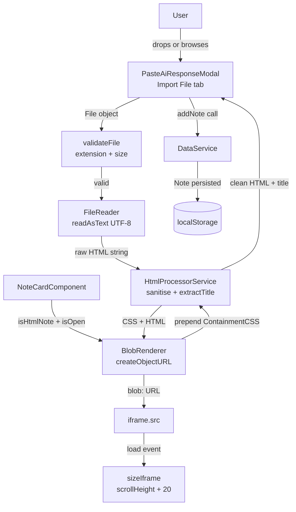

# HTML File Import — Design Document

## Overview

This feature extends the existing `PasteAiResponseModalComponent` to support direct HTML file import via a file picker and drag-and-drop interface. The modal gains a two-tab layout: the existing "Paste Text" workflow and a new "Import File" workflow. Files are read via the browser `FileReader` API, sanitised (scripts and event handlers stripped, containment CSS injected), stored as a plain HTML string in `data.markdown`, and rendered in the note card via a `Blob` URL assigned to an `<iframe>` — replacing the current `document.write` approach that breaks on large files.

The design touches three layers:

1. **Modal** (`PasteAiResponseModalComponent`) — tab UI, drag-and-drop zone, file validation, FileReader integration.
2. **Note Card** (`NoteCardComponent`) — Blob URL rendering, iframe sizing via `load` event.
3. **HTML Processor** — pure functions for sanitisation, containment CSS injection, and title extraction (shared between modal and note card).

No changes to `DataService`, `Note` model, or `richTemplate` are required; the existing `data.markdown` / `data.contentType` contract is already in place.

---

## Architecture



The `HtmlProcessorService` is a new, injectable Angular service containing only pure functions. This makes it independently testable and reusable by both the modal (sanitisation at import time) and the note card (containment CSS injection at render time).

---

## Components and Interfaces

### HtmlProcessorService (new)

```typescript
@Injectable({ providedIn: 'root' })
export class HtmlProcessorService {
  /** Remove <script> tags and inline on* event handler attributes. */
  sanitise(html: string): string { ... }

  /** Extract note title: <title> → first <h1>-<h3> → "HTML Note", truncated to 80 chars. */
  extractTitle(html: string): string { ... }

  /** Prepend the Containment_CSS <style> block to the HTML string. */
  prependContainmentCss(html: string): string { ... }

  /** Full pipeline for Blob rendering: sanitise + prependContainmentCss. */
  prepareForRendering(html: string): string { ... }
}
```

The `sanitise` method is called once at import time (in the modal). `prependContainmentCss` is called at render time (in the note card). `extractTitle` is called at import time to derive the note title.

### PasteAiResponseModalComponent (modified)

New state fields:

```typescript
activeTab: 'paste' | 'import' = 'paste';

// Import tab state
selectedFile: File | null = null;
fileHtml: string | null = null;
fileError: string | null = null;
isDragOver = false;
```

New methods:

```typescript
selectTab(tab: 'paste' | 'import'): void
onFileSelected(event: Event): void          // <input type="file"> change handler
onDrop(event: DragEvent): void
onDragOver(event: DragEvent): void
onDragLeave(event: DragEvent): void
private processFile(file: File): void       // shared by drop + browse paths
private readFile(file: File): void          // FileReader wrapper
private validateFile(file: File): string | null  // returns error string or null
```

The existing `save()` method is extended to branch on `activeTab`:
- `'paste'` tab: existing behaviour unchanged.
- `'import'` tab: calls `data.addNote(...)` with `{ markdown: fileHtml, contentType: 'html' }` and the extracted title.

### NoteCardComponent (modified)

The current `document.write` approach is replaced with Blob URL rendering:

```typescript
private blobUrl: string | null = null;

private injectBlobIframe(placeholder: Element, html: string): void {
  const prepared = this.htmlProcessor.prepareForRendering(html);
  const blob = new Blob([prepared], { type: 'text/html' });
  const url = URL.createObjectURL(blob);
  this.blobUrl = url;
  const iframe = document.createElement('iframe');
  iframe.src = url;
  iframe.setAttribute('sandbox', 'allow-same-origin');
  // ... sizing, event listeners
  placeholder.replaceWith(iframe);
}

ngOnDestroy(): void {
  if (this.blobUrl) URL.revokeObjectURL(this.blobUrl);
}
```

The `sizeIframe` method is updated to listen for the `load` event as the primary trigger, with `setTimeout` retries only as fallback for the `scrollHeight <= 50` case.

---

## Data Models

No changes to existing models. The feature relies on the existing `Note` shape:

```typescript
interface Note {
  id: string;
  title: string;           // extracted from <title> / <h1>-<h3> / "HTML Note"
  templateId: 'rich';
  data: {
    contentType: 'html';
    markdown: string;      // raw sanitised HTML string (up to 10 MB)
  };
  _collapsed: boolean;
  createdAt: number;
  updatedAt: number;
}
```

The `data.markdown` field stores the HTML string as a plain JavaScript string value — not URI-encoded, not embedded in a `data-*` attribute. The `richTemplate.renderCard` method already handles this by encoding the value into a `data-html-content` attribute on a placeholder `<div>`, which `NoteCardComponent` then reads and replaces with an iframe. After this feature, the note card will use Blob URLs instead of `document.write`, but the data model contract is unchanged.

### File Validation Rules

| Check | Limit | Error message |
|---|---|---|
| Extension | `.html` or `.htm` only | "Only .html and .htm files are supported." |
| Size | ≤ 10 MB (10 × 1024 × 1024 bytes) | "File is too large. Maximum supported size is 10 MB." |

### Containment CSS Block

The containment CSS is a constant string injected as the first child of `<head>` (or prepended to the HTML string if no `<head>` is present):

```css
<style id="lore-containment">
  *, *::before, *::after {
    animation: none !important;
    animation-delay: 0s !important;
    animation-duration: 0s !important;
    transition: none !important;
    transition-delay: 0s !important;
    transition-duration: 0s !important;
  }
  * {
    opacity: 1 !important;
    visibility: visible !important;
    transform: none !important;
  }
  .hidden, .hide, [hidden],
  .tab-pane:not(.active),
  .fade:not(.show),
  .collapse:not(.show) {
    display: block !important;
    opacity: 1 !important;
    visibility: visible !important;
  }
  html, body {
    overflow-x: hidden !important;
    box-sizing: border-box !important;
  }
  img, video, canvas, table {
    max-width: 100% !important;
  }
  input, textarea, select, button, a {
    pointer-events: none !important;
  }
</style>
```

---

## Correctness Properties

*A property is a characteristic or behavior that should hold true across all valid executions of a system — essentially, a formal statement about what the system should do. Properties serve as the bridge between human-readable specifications and machine-verifiable correctness guarantees.*

### Property 1: File Extension Validation Rejects Non-HTML Files

*For any* file object whose name does not end with `.html` or `.htm` (case-insensitive), the `validateFile` function SHALL return a non-null error string, and the file SHALL NOT be read or saved.

**Validates: Requirements 1.4**

---

### Property 2: File Size Limit Rejects Oversized Files

*For any* file object whose `size` property exceeds 10 × 1024 × 1024 bytes, the `validateFile` function SHALL return the error string "File is too large. Maximum supported size is 10 MB.", and `FileReader.readAsText` SHALL NOT be called.

**Validates: Requirements 2.5**

---

### Property 3: HTML Sanitisation Removes Scripts and Event Handlers

*For any* HTML string (including strings with zero, one, or many `<script>` elements and/or `on*` attributes in any position, with any content or nesting), the `sanitise` function SHALL return a string that contains no `<script>` tags and no attributes whose names begin with `on`.

**Validates: Requirements 3.1, 3.2**

---

### Property 4: HTML Sanitisation Preserves Non-Script Content

*For any* HTML string that contains no `<script>` elements and no `on*` attributes, the `sanitise` function SHALL return a string that is structurally equivalent to the input — all text content, `<style>` blocks, `<link>` elements, and non-script HTML tags are preserved.

**Validates: Requirements 3.3**

---

### Property 5: Title Extraction Follows Priority Order and Truncates

*For any* HTML string, the `extractTitle` function SHALL return:
- the text content of the first `<title>` element (if present), truncated to 80 characters; otherwise
- the text content of the first `<h1>`, `<h2>`, or `<h3>` element (if present), truncated to 80 characters; otherwise
- the string `"HTML Note"`.

The returned string SHALL never exceed 80 characters.

**Validates: Requirements 3.4**

---

### Property 6: Saved Note Title Matches Extracted Title

*For any* HTML string processed through the full import flow (sanitise → extractTitle → addNote), the `title` field of the persisted `Note` object SHALL equal the value returned by `extractTitle` applied to the same HTML string.

**Validates: Requirements 4.3**

---

### Property 7: Containment CSS Is Always Prepended

*For any* HTML string passed to `prependContainmentCss`, the returned string SHALL begin with (or contain before any original content) the containment `<style>` block, and the original HTML content SHALL be present and unmodified after the injected block.

**Validates: Requirements 6.1**

---

### Property 8: Iframe Height Formula

*For any* iframe whose `contentDocument.body.scrollHeight` is greater than 50 pixels, the `sizeIframe` function SHALL set `iframe.style.height` to `(scrollHeight + 20) + 'px'`.

**Validates: Requirements 7.1**

---

### Property 9: Drop and Browse Produce Identical State

*For any* valid HTML file (correct extension, within size limit), processing it via the drag-and-drop path SHALL produce the same component state (same `fileHtml`, same `selectedFile.name`, same `selectedFile.size`, no `fileError`) as processing it via the file-picker browse path.

**Validates: Requirements 8.3**

---

### Property 10: Modal Close Resets All State

*For any* modal state (any combination of selected file, loaded HTML, error message, active tab, drag-over flag), calling `cancel()` or completing a successful `save()` SHALL reset the component to its initial state: `activeTab = 'paste'`, `selectedFile = null`, `fileHtml = null`, `fileError = null`, `isDragOver = false`, `content = ''`, `isSaveDisabled = true`.

**Validates: Requirements 9.1, 9.2, 9.3**

---

## Error Handling

| Scenario | Handling |
|---|---|
| Non-HTML/HTM file extension | Inline error in Drag_Zone; file not read |
| File exceeds 10 MB | Inline error in Drag_Zone; FileReader not called |
| `FileReader` `onerror` event | Inline error showing `event.target.error.message`; save button stays disabled |
| `URL.createObjectURL` unavailable | Fall back to `document.write`; log `console.warn('Blob URL unavailable, falling back to document.write')` |
| `iframe.contentDocument` inaccessible (cross-origin) | Catch exception in `sizeIframe`; log warning; leave iframe at default height |
| `scrollHeight <= 50` after load | Retry at 300 ms and 1000 ms; if still ≤ 50 after retries, leave at default height |
| `DataService.addNote` throws | Caught at call site; show toast via `data.showToast()`; modal stays open |

All inline errors are displayed in a `.file-error` element within the Import File tab. Errors are cleared when a new file is selected or when the modal is closed.

---

## Testing Strategy

### Unit Tests

Focus on specific examples, edge cases, and error conditions:

- `HtmlProcessorService.sanitise`: specific HTML strings with scripts, event handlers, nested scripts, self-closing tags.
- `HtmlProcessorService.extractTitle`: HTML with `<title>`, HTML with only `<h1>`, HTML with neither, HTML with title longer than 80 chars.
- `HtmlProcessorService.prependContainmentCss`: verify the output starts with the containment style block.
- `validateFile`: `.html` accepted, `.htm` accepted, `.txt` rejected, `.HTML` accepted (case-insensitive), file at exactly 10 MB accepted, file at 10 MB + 1 byte rejected.
- `PasteAiResponseModalComponent`: tab switching, drag-over/leave CSS class toggling, `event.preventDefault()` called on dragover/drop, FileReader error path, save button disabled state, modal reset on close.
- `NoteCardComponent`: `URL.revokeObjectURL` called on destroy, `URL.revokeObjectURL` called on collapse, fallback to `document.write` when `createObjectURL` is undefined, `sandbox` attribute set to `allow-same-origin`.

### Property-Based Tests

Use [fast-check](https://github.com/dubzzz/fast-check) (already compatible with Angular/Jest setups).

Each property test runs a minimum of 100 iterations.

**Tag format:** `// Feature: html-file-import, Property N: <property text>`

| Property | Generator | Assertion |
|---|---|---|
| P1: Extension validation | `fc.string()` filtered to not end in `.html`/`.htm` | `validateFile` returns non-null error |
| P2: Size limit | `fc.integer({ min: 10*1024*1024 + 1, max: 50*1024*1024 })` as mock file size | `validateFile` returns size error; FileReader not called |
| P3: Sanitisation removes scripts/handlers | `fc.string()` with injected `<script>` tags and `on*` attrs | Output contains no `<script>` and no `on\w+=` |
| P4: Sanitisation preserves content | `fc.string()` filtered to contain no `<script>` or `on*` attrs | `sanitise(html) === html` (structurally) |
| P5: Title extraction priority + truncation | `fc.record({ title: fc.option(fc.string()), h1: fc.option(fc.string()) })` | Correct priority; `result.length <= 80` |
| P6: Title round-trip | `fc.string()` as HTML | `note.title === extractTitle(html)` |
| P7: Containment CSS prepended | `fc.string()` as HTML | Output contains containment style block before original content |
| P8: Iframe height formula | `fc.integer({ min: 51, max: 100000 })` as scrollHeight | `iframe.style.height === (scrollHeight + 20) + 'px'` |
| P9: Drop/browse equivalence | `fc.record({ name: fc.string(), content: fc.string(), size: fc.integer({ min: 1, max: 10*1024*1024 }) })` | State after drop === state after browse |
| P10: Modal reset | `fc.record({ activeTab, selectedFile, fileHtml, fileError, isDragOver })` | After close, all fields equal initial values |

### Integration Tests

- Full import flow: select file → read → sanitise → save → verify note appears in section with correct title and `contentType: 'html'`.
- Blob URL rendering: import HTML note → expand note card → verify iframe `src` starts with `blob:` and content is visible.
- Memory cleanup: expand note card → collapse → verify `URL.revokeObjectURL` was called.
- Large file (near 10 MB): verify import completes without error and note renders correctly.
- Drag-and-drop: simulate `dragover` + `drop` events → verify same outcome as file picker.
