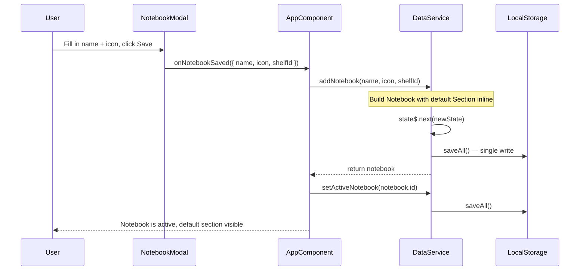

# Design Document: Notebook Default Page

## Overview

When a user creates a new Notebook in Lore, the app currently leaves it empty — the user must manually add a Section before writing anything. This feature eliminates that friction by automatically inserting a default "Page" Section into every newly created Notebook, so the user lands in a ready-to-write state immediately.

The change is intentionally narrow:

- Only the **new notebook creation path** is affected.
- Existing notebooks, imported notebooks, and the demo seed data are explicitly excluded.
- The implementation is a single atomic state mutation — no intermediate "notebook without section" state is ever observable.

---

## Architecture

The feature touches two layers:

1. **`DataService.addNotebook()`** — the single source of truth for notebook creation. The default section is built inline here, so the notebook enters state already containing its section. This keeps the mutation atomic and ensures `saveAll` is called exactly once.

2. **`AppComponent.onNotebookSaved()`** — currently calls `addNotebook()` but does not set the new notebook as active. This method needs to call `data.setActiveNotebook()` after creation so the user is taken directly into the new notebook.

No new services, components, or files are required.



---

## Components and Interfaces

### `DataService.addNotebook()` — modified

**Current signature:**
```typescript
addNotebook(name: string, icon: string, shelfId: string): Notebook
```

**Change:** Build the default `Section` object inline before calling `state$.next()`, so the notebook is persisted with its section in a single update.

The `seedDemoData()` method calls `addNotebook()` and then adds its own sections manually. To prevent a spurious "Page" section from appearing in the demo notebook, `addNotebook()` will accept an optional `skipDefaultSection` flag:

```typescript
addNotebook(name: string, icon: string, shelfId: string, skipDefaultSection?: boolean): Notebook
```

When `skipDefaultSection` is `true` (used only by `seedDemoData()`), the method behaves exactly as it does today — an empty `sections: []` array. When `false` or omitted (the default), the default section is added.

### `AppComponent.onNotebookSaved()` — modified

**Current behavior:** calls `addNotebook()` and discards the return value.

**Change:** capture the returned `Notebook` and call `data.setActiveNotebook(notebook.id)` when creating (not editing) a notebook.

```typescript
onNotebookSaved(payload: { name: string; icon: string; shelfId: string }): void {
  if (this.editingNotebook) {
    this.data.updateNotebook(this.editingNotebook.id, payload.name, payload.icon);
  } else {
    const notebook = this.data.addNotebook(payload.name, payload.icon, payload.shelfId);
    this.data.setActiveNotebook(notebook.id);
  }
  this.showNotebookModal = false;
  this.editingNotebook = null;
}
```

---

## Data Models

No changes to the `Notebook`, `Section`, or `AppState` interfaces in `models/index.ts`. The default section is a standard `Section` object:

```typescript
const defaultSection: Section = {
  id: this.uid(),       // unique id from DataService.uid()
  title: 'Page',
  subtitle: '',
  color: 'purple',
  notes: [],
};
```

The notebook is then constructed as:

```typescript
const notebook: Notebook = {
  id: this.uid(),
  name,
  icon,
  shelfId,
  sections: [defaultSection],   // ← default section included at construction time
};
```

This means the state transition goes directly from "no notebook" to "notebook with one section" — there is no intermediate state.

---

## Correctness Properties

*A property is a characteristic or behavior that should hold true across all valid executions of a system — essentially, a formal statement about what the system should do. Properties serve as the bridge between human-readable specifications and machine-verifiable correctness guarantees.*

### Property 1: New Notebook Always Has a Default Section

*For any* valid combination of notebook name, icon, and shelfId, calling `DataService.addNotebook()` (without `skipDefaultSection`) SHALL return a Notebook whose `sections` array contains exactly one Section with `title === "Page"`, `subtitle === ""`, `color === "purple"`, and `notes.length === 0`.

**Validates: Requirements 1.1, 1.5**

---

### Property 2: Default Section Has a Unique ID

*For any* sequence of `addNotebook()` calls, all default section `id` values SHALL be distinct non-empty strings.

**Validates: Requirements 1.4**

---

### Property 3: Notebook Creation Is Atomic — Section Present in State Immediately

*For any* `addNotebook()` call, the state observable immediately after the call SHALL contain the new notebook with its default section already present — there is no observable intermediate state where the notebook exists without its section.

**Validates: Requirements 1.2, 4.1**

---

### Property 4: Persistence Round-Trip Preserves Default Section

*For any* notebook created with `addNotebook()`, calling `saveAll()` followed by `loadAll()` in a fresh `DataService` instance SHALL restore the notebook with its default section intact (same `title`, `subtitle`, `color`, `notes`, and `id`).

**Validates: Requirements 4.1, 4.2**

---

### Property 5: `updateNotebook()` Does Not Modify Sections

*For any* notebook with any number of sections, calling `updateNotebook()` with a new name or icon SHALL leave the `sections` array reference-equal in content (same ids, titles, subtitles, colors, and notes).

**Validates: Requirements 2.2**

---

### Property 6: `loadAll()` Does Not Mutate Sections

*For any* persisted state containing notebooks with N sections each, calling `loadAll()` SHALL restore each notebook with exactly N sections — no sections are added or removed during load.

**Validates: Requirements 2.1**

---

## Error Handling

This feature introduces no new error conditions. The existing error handling in `DataService` covers all relevant cases:

- **`uid()` collision**: Statistically negligible; `uid()` combines `Date.now()` with a random suffix.
- **`saveAll()` quota exceeded**: Already handled — shows a toast and does not throw.
- **Invalid `shelfId`**: Not validated today; out of scope for this feature.

---

## Testing Strategy

### Unit / Example Tests

These cover specific behaviors and code paths that are not universal across all inputs:

| Test | What it verifies |
|---|---|
| `onNotebookSaved()` sets active notebook | After creating a notebook, `activeNotebookId` equals the new notebook's id (Req 1.3) |
| `updateNotebook()` does not add sections | Editing a notebook's name/icon leaves sections unchanged (Req 2.2) |
| `appendNotebook()` import path is unaffected | Importing a notebook with known sections does not add a "Page" section (Req 2.3) |
| `seedDemoData()` sections are unchanged | Demo notebook has exactly the expected sections, no extra "Page" section (Req 3.1, 3.2) |
| `addNotebook()` calls `saveAll` exactly once | Spy on `saveAll`; verify it is called once, not twice (Req 4.1) |

### Property-Based Tests

Each property test runs a minimum of **100 iterations** with randomly generated inputs. Tests are tagged with the property they validate.

**Tag format:** `Feature: notebook-default-page, Property {N}: {property_text}`

| Property | Test description | Iterations |
|---|---|---|
| Property 1 | Random (name, icon, shelfId) → section has correct title/subtitle/color/notes | 100 |
| Property 2 | N random `addNotebook()` calls → all default section ids are distinct | 100 |
| Property 3 | After `addNotebook()`, state immediately contains notebook + section together | 100 |
| Property 4 | Save + reload round-trip preserves default section fields | 100 |
| Property 5 | `updateNotebook()` with random new name/icon → sections array unchanged | 100 |
| Property 6 | Save state with N sections, reload → each notebook still has N sections | 100 |

### Test File

New tests are added to `lore-app/src/app/services/data.service.spec.ts`, following the existing pattern of `describe` blocks with a property header comment. The Angular `TestBed` + `localStorage` spy pattern already established in the file is reused.

### What Is Not Tested Here

- **Drive / Gist sync payload** (Req 4.3): The sync payload is the same `AppState` object that `saveAll` persists. Since Property 4 already verifies the section is in state before `saveAll` is called, the sync payload is implicitly correct. A dedicated integration test against a mocked Drive/Gist service is out of scope for this unit-level spec.
- **UI rendering of the default section**: Covered by existing `ContentAreaComponent` rendering tests.
