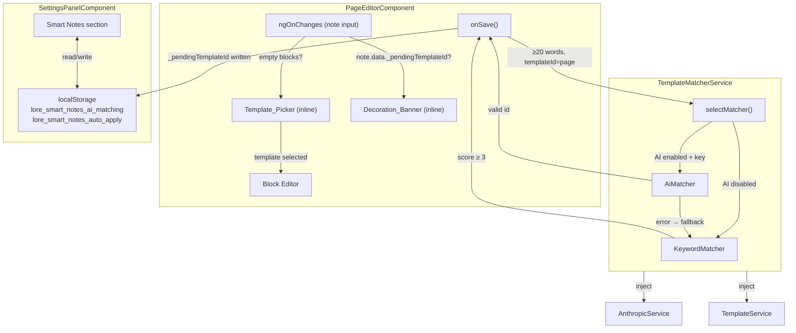

# Design Document — Smart Template Selection

## Overview

Smart Template Selection adds two complementary UX flows to the Lore page editor:

1. **In-page Template Picker** — when a user opens a new blank page note, an inline picker appears inside the editor body. The user can select a template (switching the editor to that template's form in-place) or dismiss the picker and write freely.

2. **Background Template Decoration** — after a free-form page note is saved with enough content, a `TemplateMatcher` service analyses the text silently in the background. The best-matching template id is stored as `_pendingTemplateId` on the note. The next time the note is opened, a `Decoration_Banner` offers to apply the suggestion. The user can accept, dismiss, or (if auto-apply is on) have it applied automatically.

Both flows are non-blocking and non-modal. The user is never interrupted while writing.

---

## Architecture



### Key design decisions

- **No new modal or drawer.** Both the picker and the banner are rendered as inline sections within the existing `page-editor.component.html`. This keeps the component self-contained and avoids z-index / overlay complexity.
- **`_pendingTemplateId` lives in `note.data`.** The `Note` model already has `data: Record<string, any>`, so no schema migration is needed. The field is a private convention (prefixed `_`) and is stripped before display.
- **`TemplateMatcher` is a new injectable service.** It is injected into `PageEditorComponent` and is the single entry point for both keyword and AI matching. This keeps the page editor free of matching logic.
- **Background analysis is fire-and-forget.** `onSave()` calls `runBackgroundAnalysis()` without `await`. The analysis writes back to the note via a separate `DataService` call after completion.
- **Settings are plain `localStorage` reads/writes.** No new Angular service is needed for settings persistence; the `SettingsPanelComponent` reads and writes the two keys directly.

---

## Components and Interfaces

### 1. `TemplateMatcherService` (new)

**File:** `lore-app/src/app/services/template-matcher.service.ts`

```typescript
export interface MatchResult {
  templateId: string;
  score: number;       // keyword count, or 1.0 for AI match
  source: 'keyword' | 'ai';
}

@Injectable({ providedIn: 'root' })
export class TemplateMatcherService {
  // Injected
  private templateService = inject(TemplateService);
  private anthropicService = inject(AnthropicService);

  /** Entry point called after save. Returns null if no match. */
  async analyseContent(text: string): Promise<MatchResult | null>;

  /** Keyword-only path. */
  matchByKeywords(text: string): MatchResult | null;

  /** AI path. Falls back to keyword on error. */
  async matchByAi(text: string): Promise<MatchResult | null>;

  /** Settings helpers */
  isAiMatchingEnabled(): boolean;
  isAutoApplyEnabled(): boolean;
}
```

**Keyword sets** (defined as a constant map inside the service):

| Template id | Representative keywords |
|---|---|
| `finance` | budget, revenue, expense, profit, loss, cash flow, invoice, balance sheet, P&L, quarterly, fiscal, ROI, EBITDA |
| `journal` | today, mood, grateful, gratitude, reflection, intention, energy, morning, evening, diary, feelings, mindset |
| `research` | hypothesis, methodology, findings, literature, abstract, citation, conclusion, analysis, study, experiment, data |
| `scrum` | sprint, backlog, standup, velocity, story points, retrospective, epic, user story, kanban, blocker, ticket |
| `investing` | portfolio, dividend, yield, stock, ETF, allocation, rebalance, compound, index fund, asset, equity, bond |
| `watchlist` | watch, rating, review, recommend, seen, episode, season, genre, director, cast, score, IMDb |

**Scoring algorithm:**
1. Lowercase the full text.
2. For each template, count how many of its keywords appear (whole-word match, case-insensitive).
3. Return the template with the highest count if that count ≥ 3, otherwise return `null`.

**AI prompt template:**

```
You are a note-categorisation assistant. Given the following note content, 
identify the single best-matching template from this list:
finance, journal, research, scrum, investing, watchlist, page

Reply with ONLY the template id (e.g. "journal") or "null" if none fits well.
Do not explain your answer.

Note content:
<content>
```

The service parses the first word of the AI response, validates it against the known id list, and returns `null` if the response is not a valid id.

---

### 2. `PageEditorComponent` changes

**File:** `lore-app/src/app/components/page-editor/page-editor.component.ts`

New state fields:

```typescript
// Template Picker
showTemplatePicker = false;

// Decoration Banner
pendingTemplateId: string | null = null;
pendingTemplateName = '';
pendingTemplateIcon = '';

// Auto-apply toast
showUndoToast = false;
undoToastTimer: any = null;

// Injected
private templateMatcher = inject(TemplateMatcherService);
private templateService = inject(TemplateService);
```

**`loadFromNote()` changes:**

```typescript
private loadFromNote(): void {
  // ... existing logic ...

  // Decoration Banner
  this.pendingTemplateId = this.note.data?.['_pendingTemplateId'] ?? null;
  if (this.pendingTemplateId) {
    const tpl = this.templateService.getTemplate(this.pendingTemplateId);
    this.pendingTemplateName = tpl?.name ?? this.pendingTemplateId;
    this.pendingTemplateIcon = tpl?.icon ?? '📄';
    if (this.templateMatcher.isAutoApplyEnabled()) {
      this.applyPendingTemplate(/* showToast */ true);
    }
  }

  // Template Picker: show only for new empty notes
  const hasContent = this.blocks.some(b => b.content.trim() !== '' || b.type === 'divider');
  this.showTemplatePicker = !hasContent && !this.pendingTemplateId;
}
```

**New methods:**

```typescript
// Template Picker
onPickerSelectTemplate(templateId: string): void { ... }
onPickerDismiss(): void { this.showTemplatePicker = false; }

// Decoration Banner
onBannerApply(): void { this.applyPendingTemplate(false); }
onBannerDismiss(): void { this.clearPendingTemplate(); }

// Auto-apply undo
onUndoAutoApply(): void { ... }

// Background analysis (called from onSave)
private runBackgroundAnalysis(noteId: string, text: string): void { ... }

// Shared helpers
private applyPendingTemplate(showToast: boolean): void { ... }
private clearPendingTemplate(): void { ... }
private extractPlainText(): string { ... }
```

**`onSave()` changes:**

```typescript
onSave(): void {
  const payload = { ... }; // existing
  this.saved.emit(payload);
  this.isDirty = false;

  // Post-save background analysis hook
  const wordCount = this.extractPlainText().split(/\s+/).filter(Boolean).length;
  if (wordCount >= 20 && !this.pendingTemplateId) {
    this.runBackgroundAnalysis(this.note.id, this.extractPlainText());
  }
}
```

**Template Picker inline form** (rendered in HTML when `showTemplatePicker`):

The picker renders as a `<div class="pg-template-picker">` inserted between the title row and the block editor. It contains:
- A grid of template cards (icon + name + color accent dot), one per template from `TemplateService.getTemplates()`.
- A "Start blank" button that calls `onPickerDismiss()`.

Selecting a template card calls `onPickerSelectTemplate(templateId)`. If `templateId === 'page'`, the picker is dismissed and the block editor remains. Otherwise, the picker and block editor are hidden and the selected template's form is rendered inline (same pattern as the existing `edit-panel` template form rendering).

**Decoration Banner inline element** (rendered in HTML when `pendingTemplateId && !showTemplatePicker`):

```html
<div class="pg-decoration-banner">
  <span class="pg-dec-icon">{{ pendingTemplateIcon }}</span>
  <span class="pg-dec-msg">
    This note looks like a <strong>{{ pendingTemplateName }}</strong>. Apply its structure?
  </span>
  <button class="btn-dec-apply" (click)="onBannerApply()">
    Apply {{ pendingTemplateName }}
  </button>
  <button class="btn-dec-dismiss" (click)="onBannerDismiss()">Keep as plain note</button>
</div>
```

---

### 3. `SettingsPanelComponent` changes

**File:** `lore-app/src/app/components/settings-panel/settings-panel.component.ts`

New fields:

```typescript
smartNotesAiMatching = false;
smartNotesAutoApply = false;
```

New methods:

```typescript
onSmartNotesAiMatchingChange(): void {
  if (this.smartNotesAiMatching) {
    localStorage.setItem('lore_smart_notes_ai_matching', 'true');
  } else {
    localStorage.removeItem('lore_smart_notes_ai_matching');
  }
}

onSmartNotesAutoApplyChange(): void {
  if (this.smartNotesAutoApply) {
    localStorage.setItem('lore_smart_notes_auto_apply', 'true');
  } else {
    localStorage.removeItem('lore_smart_notes_auto_apply');
  }
}
```

`ngOnChanges` reads both keys when the panel opens:

```typescript
this.smartNotesAiMatching = localStorage.getItem('lore_smart_notes_ai_matching') === 'true';
this.smartNotesAutoApply  = localStorage.getItem('lore_smart_notes_auto_apply')  === 'true';
```

**HTML section** (inserted after the AI Provider section):

```html
<!-- ── Smart Notes ── -->
<div class="sp-sec" style="margin-top: 4px">
  <div class="sp-sec-ttl">Smart Notes</div>
</div>
<div class="sp-smart-notes">
  <label class="sp-ai-sync-label" [class.disabled]="!hasApiKey">
    <input
      type="checkbox"
      [(ngModel)]="smartNotesAiMatching"
      (ngModelChange)="onSmartNotesAiMatchingChange()"
      [disabled]="!hasApiKey"
    />
    AI template matching
    <span *ngIf="!hasApiKey" class="sp-hint">Requires an AI provider API key</span>
  </label>
  <label class="sp-ai-sync-label">
    <input
      type="checkbox"
      [(ngModel)]="smartNotesAutoApply"
      (ngModelChange)="onSmartNotesAutoApplyChange()"
    />
    Auto-apply matched template
  </label>
</div>
```

---

## Data Models

No new model types are required. The feature uses existing types with one new convention:

### `_pendingTemplateId` field on `Note.data`

```typescript
// Stored in note.data (Record<string, any>)
note.data['_pendingTemplateId'] = 'journal'; // set by TemplateMatcherService
note.data['_pendingTemplateId'] = undefined;  // cleared on accept or dismiss
```

This field is:
- Written by `TemplateMatcherService` after background analysis.
- Read by `PageEditorComponent.loadFromNote()`.
- Cleared by `onBannerApply()` and `onBannerDismiss()`.
- Never rendered in the note card (the `renderCard` functions ignore unknown `_`-prefixed keys).

### localStorage keys

| Key | Type | Default | Description |
|---|---|---|---|
| `lore_smart_notes_ai_matching` | `'true'` / absent | absent (off) | AI matching enabled |
| `lore_smart_notes_auto_apply` | `'true'` / absent | absent (off) | Auto-apply on re-open |

### `MatchResult` interface

```typescript
export interface MatchResult {
  templateId: string;   // one of the known built-in ids
  score: number;        // keyword count (keyword path) or 1 (AI path)
  source: 'keyword' | 'ai';
}
```

---

## Correctness Properties

*A property is a characteristic or behavior that should hold true across all valid executions of a system — essentially, a formal statement about what the system should do. Properties serve as the bridge between human-readable specifications and machine-verifiable correctness guarantees.*

### Property 1: Picker visibility is determined by content and dismissed state

*For any* page note, the Template_Picker should be visible if and only if the note has no non-empty block content AND the picker has not been dismissed.

**Validates: Requirements 1.1, 1.4, 1.6, 1.7**

---

### Property 2: Template list completeness

*For any* set of custom templates stored in localStorage, the list returned by `getTemplatesForPicker()` should contain every built-in template and every custom template — no more, no fewer.

**Validates: Requirements 1.2**

---

### Property 3: Picker item rendering contains required fields

*For any* `TemplateDefinition`, the rendered picker card HTML should contain the template's `icon`, `name`, and `color` values.

**Validates: Requirements 1.3**

---

### Property 4: Title is preserved across template selection

*For any* non-empty title string, after the user selects a template from the picker, the template form's title field should be pre-populated with that exact title string.

**Validates: Requirements 2.2**

---

### Property 5: Background analysis threshold

*For any* page note content string, `shouldRunAnalysis(content, templateId)` should return `true` if and only if the word count is ≥ 20 and `templateId === 'page'`.

**Validates: Requirements 3.1, 3.6**

---

### Property 6: Pending template id is set iff score meets threshold

*For any* note content and any keyword scoring result, after `analyseContent()` completes: if the highest keyword score ≥ 3 (or AI returns a valid id), then `note.data._pendingTemplateId` should equal the matched template id; otherwise `_pendingTemplateId` should be absent.

**Validates: Requirements 3.3, 3.5, 4.3, 4.4**

---

### Property 7: Keyword scoring is case-insensitive and additive

*For any* text string and any keyword set, `scoreKeywords(text, keywords)` should return a count equal to the number of keywords that appear in the lowercased text (whole-word match). Changing the case of any keyword occurrence in the text should not change the score.

**Validates: Requirements 4.2**

---

### Property 8: AI prompt contains all valid template ids

*For any* note content string, the prompt string constructed by `buildAiPrompt(content)` should contain each of the valid template ids: `finance`, `journal`, `research`, `scrum`, `investing`, `watchlist`, `page`.

**Validates: Requirements 5.2**

---

### Property 9: Decoration Banner visibility

*For any* page note, the Decoration_Banner should be visible if and only if `note.data._pendingTemplateId` is a non-empty string and auto-apply is disabled.

**Validates: Requirements 6.1, 6.5**

---

### Property 10: Settings round-trip

*For any* pair of boolean values `(aiMatching, autoApply)`, writing them to localStorage via `onSmartNotesAiMatchingChange()` / `onSmartNotesAutoApplyChange()` and then reading them back should return the same pair of values.

**Validates: Requirements 7.4, 8.1, 8.2**

---

**Property Reflection — redundancy check:**

- Properties 1 and 9 are distinct: Property 1 covers picker visibility, Property 9 covers banner visibility. Both are needed.
- Property 6 subsumes the "no match → no pending id" case (Req 3.5), so no separate property is needed for that.
- Property 5 subsumes the "non-page templateId → no analysis" guard (Req 3.6).
- Properties 7 and 6 are complementary: Property 7 tests the scoring function in isolation; Property 6 tests the end-to-end threshold decision.
- No further consolidation is warranted.

---

## Error Handling

| Scenario | Handling |
|---|---|
| AI provider returns an error or times out | `matchByAi()` catches the exception, logs a warning to console, and falls back to `matchByKeywords()`. No error is shown to the user. |
| AI response is not a valid template id | The response is discarded; `matchByAi()` returns `null` and the keyword result is used. |
| No API key configured | `isAiMatchingEnabled()` returns `false` even if the localStorage flag is `true`. The AI path is never entered. |
| `_pendingTemplateId` references a deleted custom template | `getTemplate()` returns `undefined`; the banner shows a generic "Apply suggestion" label and the apply action is a no-op (the template no longer exists). |
| Background analysis throws unexpectedly | Wrapped in a top-level `try/catch` inside `runBackgroundAnalysis()`; error is logged, note is unchanged. |
| Word count < 20 | `runBackgroundAnalysis()` is not called; no side effects. |

---

## Testing Strategy

### Unit tests (example-based)

- `TemplateMatcherService.matchByKeywords()` — concrete examples for each template's keyword set.
- `TemplateMatcherService.matchByAi()` — mock `AnthropicService.sendMessage()` to return valid id, invalid string, and throw error; verify correct fallback behaviour.
- `PageEditorComponent` — verify picker shown/hidden on note open with empty vs. non-empty blocks.
- `PageEditorComponent` — verify banner shown/hidden based on `_pendingTemplateId` presence.
- `PageEditorComponent.onSave()` — verify `runBackgroundAnalysis` is called only when word count ≥ 20 and `templateId === 'page'`.
- `SettingsPanelComponent` — verify checkboxes reflect localStorage values on open; verify AI checkbox disabled when no API key.

### Property-based tests (using [fast-check](https://github.com/dubzzz/fast-check))

Each property test runs a minimum of **100 iterations**.

Tag format: `// Feature: smart-template-selection, Property N: <property text>`

| Property | Generator | Assertion |
|---|---|---|
| P1: Picker visibility | `fc.record({ blocks: fc.array(fc.string()), dismissed: fc.boolean() })` | `showPicker === (noContent && !dismissed)` |
| P2: Template list completeness | `fc.array(arbitraryCustomTemplate())` | `getTemplatesForPicker().length === builtIns.length + customs.length` |
| P3: Picker item rendering | `arbitraryTemplateDefinition()` | rendered HTML contains icon, name, color |
| P4: Title preservation | `fc.string({ minLength: 1 })` | after `onPickerSelectTemplate`, form title === original title |
| P5: Analysis threshold | `fc.record({ content: fc.string(), templateId: fc.string() })` | `shouldRunAnalysis` iff wordCount ≥ 20 && templateId === 'page' |
| P6: Pending id set iff threshold met | `fc.record({ text: fc.string(), scores: fc.dictionary(...) })` | `_pendingTemplateId` present iff max score ≥ 3 |
| P7: Keyword scoring case-insensitive | `fc.record({ text: fc.string(), keywords: fc.array(fc.string()) })` | `score(text) === score(text.toUpperCase())` |
| P8: AI prompt completeness | `fc.string()` | prompt contains all 7 valid template ids |
| P9: Banner visibility | `fc.record({ pendingId: fc.option(fc.string()), autoApply: fc.boolean() })` | `showBanner === (!!pendingId && !autoApply)` |
| P10: Settings round-trip | `fc.record({ ai: fc.boolean(), auto: fc.boolean() })` | read after write returns same values |
